# Credit_Risk_Analysis
Supervised Machine Learning 

## Overview of the Analysis
### Purpose

Fast-Lending is a peer-to-peer lending service company. They are interested in using machine learning to predict credit risk to lower the default rate of potential customers. They would like to provide a quicker and more reliable loan service by using a machine learning model that can accurately identify low and high-risk borrowers. 
In this analysis, Python was used to build six different machine learning models to predict credit risk. Each models performance will be evaluated. The following machine learning models were created using different algorithms:

* Naive Random Oversampling and SMOTE algorithms were used to oversample the data
* Cluster Centroids algorithm was used to under-sampling the data
* SMOTEENN algorithm was used for a combination of over and under-sampling 
* Balanced Random Forest Classifier and Easy Ensemble AdaBoost classifier algorithms were used to reduce bias 

### Resources
* Python     
* Jupyter Notebook
* Pandas
* Scikit-learn
* Data Source:     

## Results
Balanced Accuracy Scores, Confusion Matrixes and Imbalanced Classification Reports

### Naive Random Oversampling 

* #### Accuracy Score
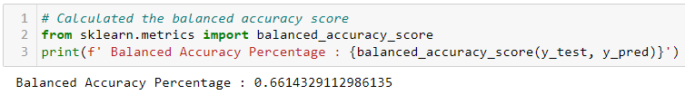

* #### Confusion Matrix
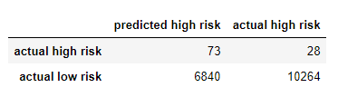

* #### Classification Report
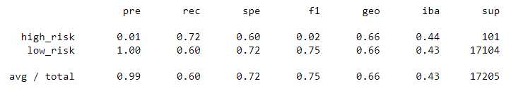

xxx

### SMOTE Oversampling 

* #### Accuracy Score
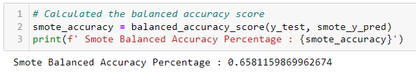

* #### Confusion Matrix
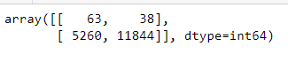

* #### Classification Report
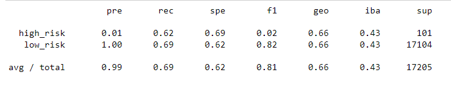

xxx

### Undersampling with Cluster Centroids 

* #### Accuracy Score
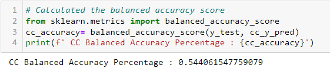

* #### Confusion Matrix
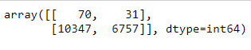

* #### Classification Report
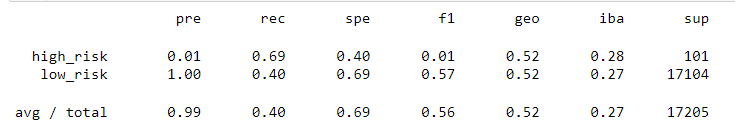

xxx

### SMOTEENN Combination Sampling 

* #### Accuracy Score
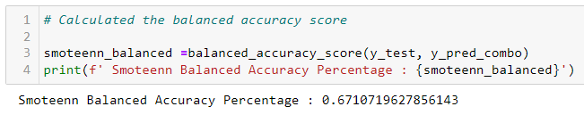

* #### Confusion Matrix
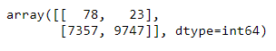

* #### Classification Report
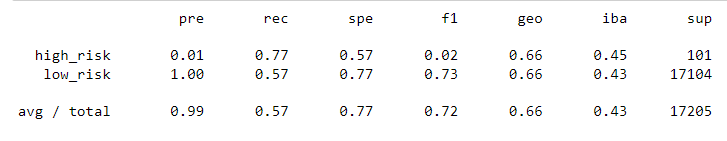

xxx

### Balanced Random Forest Classifier

* #### Accuracy Score
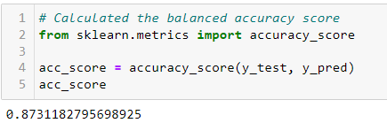

* #### Confusion Matrix
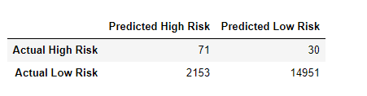

* #### Classification Report
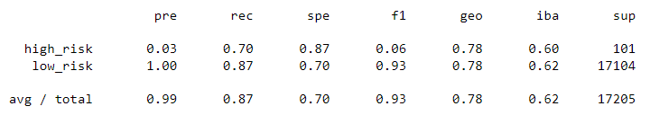

xxx

### Easy Ensemble AdaBoost Classifier

* #### Accuracy Score
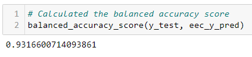

* #### Confusion Matrix
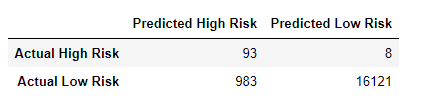

* #### Classification Report
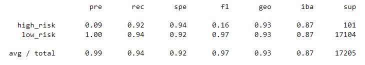

xxx

## Summary
